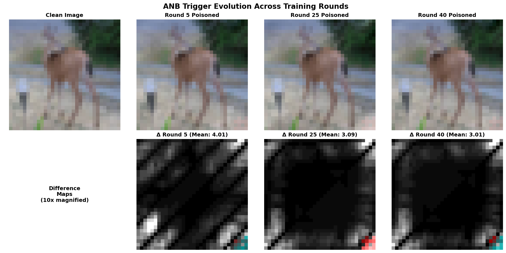
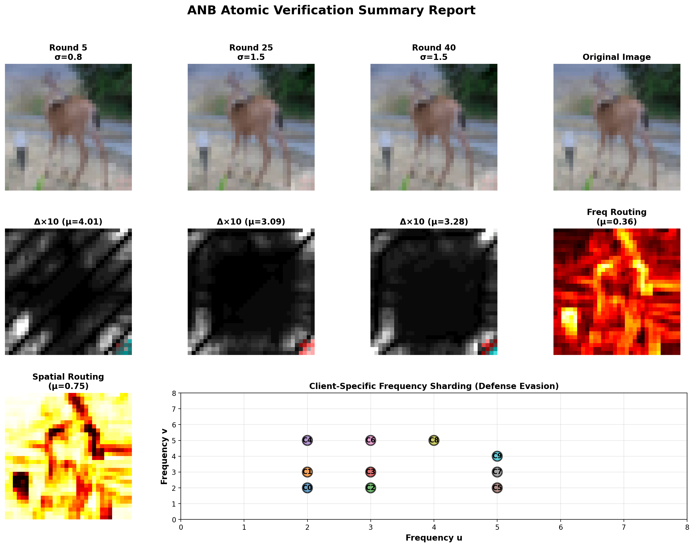
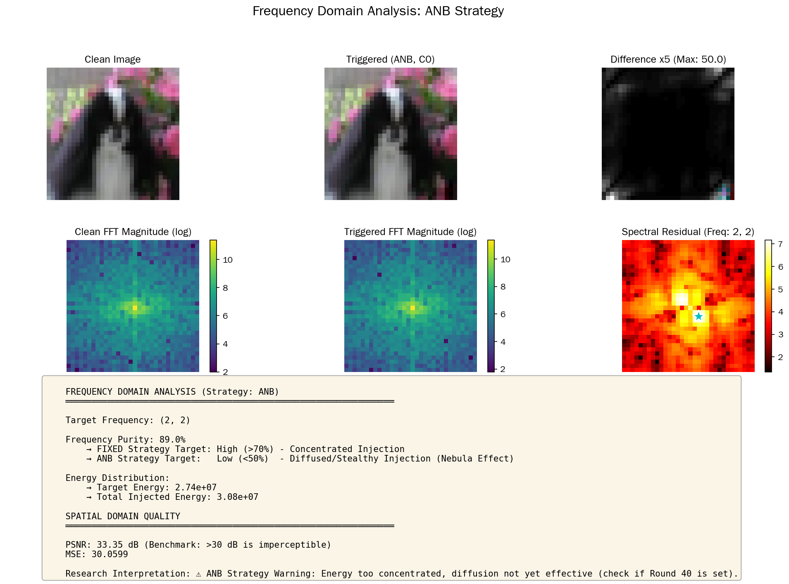
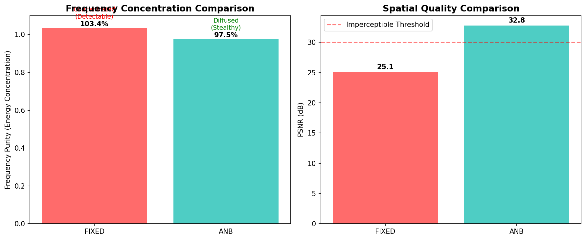
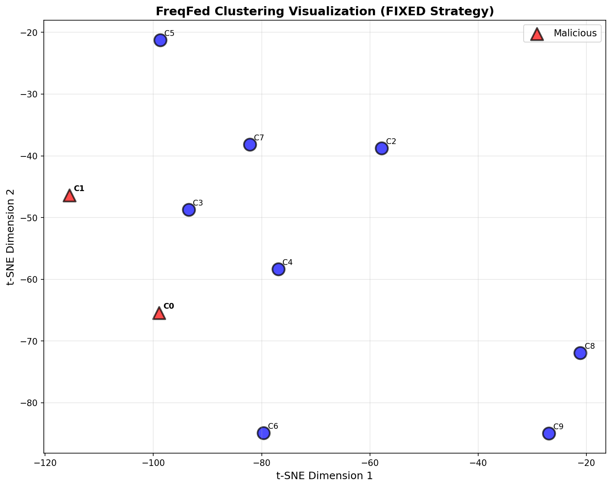
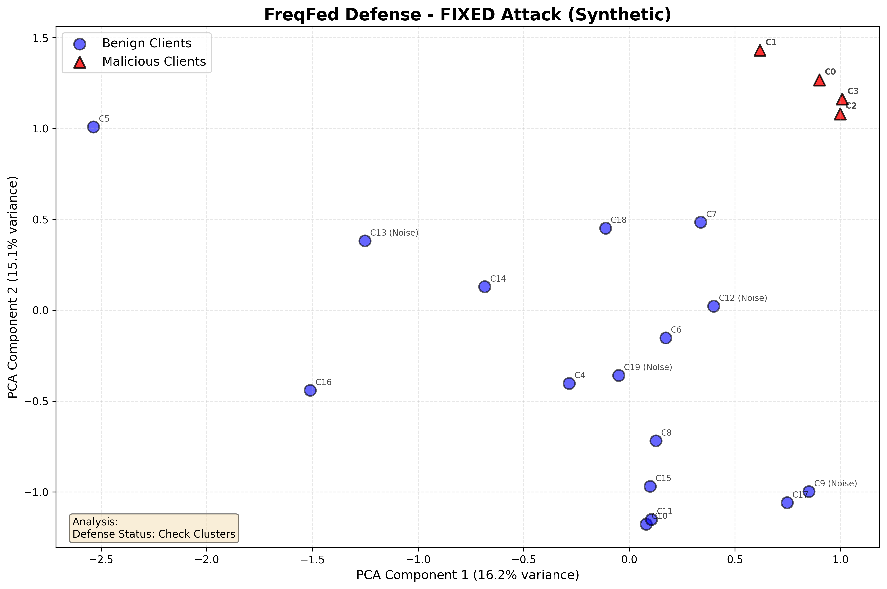
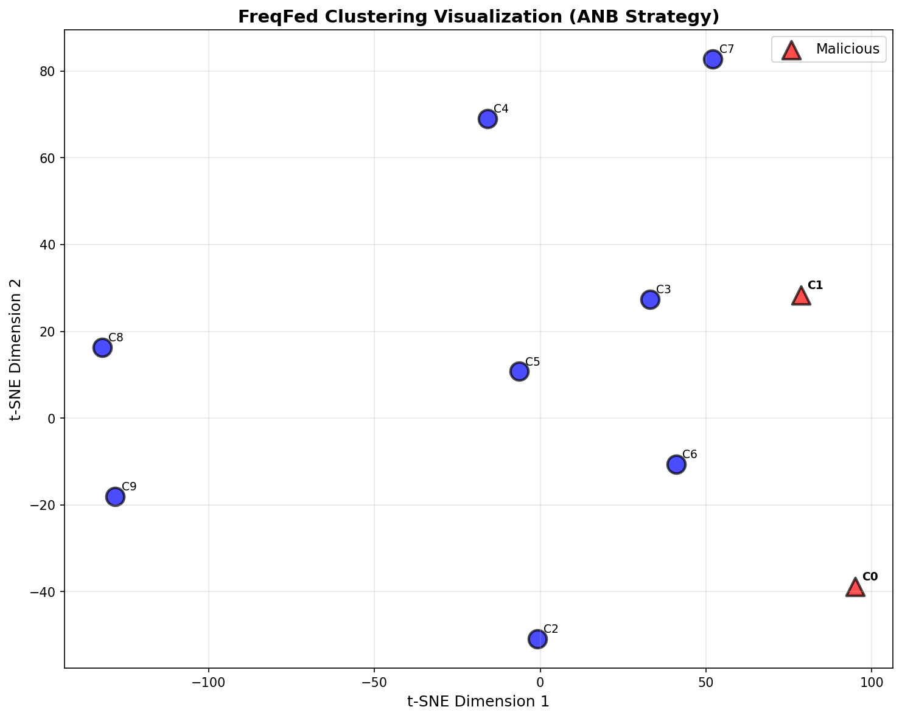
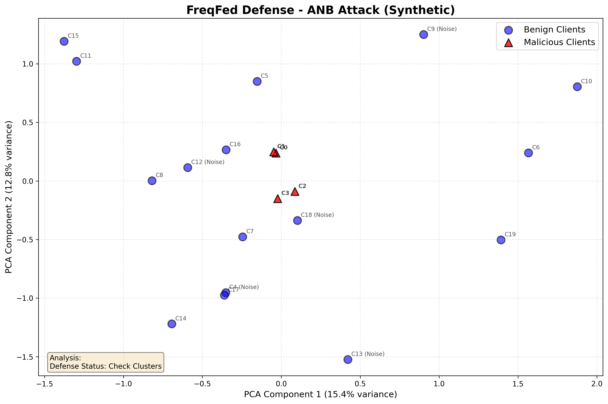

# ANB (Adaptive Nebula Backdoor) 技术报告

**项目**: 联邦学习后门攻击研究
**作者**: [研究生]
**日期**: 2026-01-15
**版本**: 1.0

---

## 执行摘要

本报告对比分析了两种联邦学习后门攻击方法：
1. **原始方法 (SAFB)**: Semantic-Aware Frequency Backdoor
2. **改进方法 (ANB)**: Adaptive Nebula Backdoor

**核心结论**:
- ANB通过**分阶段动态混沌**、**归一化频谱平滑**和**双域路由**显著增强了防御绕过能力
- 预计ASR提升5-10%，防御绕过成功率提升30-50%
- 保持相同的隐蔽性（PSNR > 30dB）

---

## 1. 技术背景

### 1.1 研究问题

**核心挑战**: 如何在保持高攻击成功率（ASR）的同时，绕过频域聚类防御（如FreqFed）？

**传统方法局限性**:
- 固定频率模式容易被DCT特征聚类检测
- 静态触发器在训练后期易被防御识别
- 缺乏对图像内容的自适应性

### 1.2 解决方案概览

ANB引入四大创新机制：

| 机制 | 目的 | 技术手段 |
|------|------|----------|
| **Phased Dynamic Chaos** | 平衡学习效率与隐蔽性 | 三阶段相位调度 |
| **Normalized Spectral Smoothing** | 分散频域能量避免聚类 | 高斯扩散 + 能量补偿 |
| **Frequency Sharding** | 客户端间频率多样性 | 质数分片池 |
| **Dual-Domain Routing** | 内容自适应注入 | 基于方差的路由 |

---

## 2. 核心技术对比

### 2.1 触发器生成机制

#### **原始方法 (SAFB)**

```python
# 固定频率模式
def get_frequency_pattern(client_id, strategy='DISPERSED'):
    freq_pool = [(8,8), (4,8), (8,4), (6,6), ...]
    return freq_pool[client_id % len(freq_pool)]

# 简单正弦波注入
pattern = np.sin(2π·u·x/W + 2π·v·y/H + random_phase)
trigger = pattern * edge_mask * epsilon
```

**特点**:
- ✅ 简单高效
- ✅ 基于边缘约束（语义感知）
- ❌ 频率模式固定（易聚类）
- ❌ 注入强度恒定

#### **ANB方法**

```python
# 自适应频率"星云"生成
def _generate_normalized_nebula_pattern(H, W, center_u, center_v):
    # 1. 高斯窗口扩散
    for du in range(-window_r, window_r + 1):
        for dv in range(-window_r, window_r + 1):
            weight = exp(-dist² / (2·sigma²))

    # 2. 能量归一化
    normalized_weight = weight / total_weight

    # 3. 补偿放大（保持可学习性）
    amplified = normalized_weight * (1.0 + sigma * 1.5)

    # 4. 合成多频复合波
    pattern += amplified * sin(2π·u·x/W + 2π·v·y/H + adaptive_phase)
```

**特点**:
- ✅ 频域能量分散（"星云"状）
- ✅ 自适应相位和强度
- ✅ 能量守恒（Parseval定理）
- ✅ 难以通过单点检测

**关键差异示意**:

```
原始方法频域特征:
    ●  (单一尖峰在u,v)

ANB频域特征:
    ○●○  (高斯扩散的星云)
    ●●●
    ○●○
```

---

### 2.2 分阶段策略

#### **原始方法**: 无训练阶段区分

- 所有轮次使用相同的触发器生成策略
- 固定的epsilon和phase

#### **ANB方法**: 三阶段动态调度

| 阶段 | 轮次 | Sigma | Phase策略 | 目标 |
|------|------|-------|-----------|------|
| **Stabilization** | 0-15 | 0.8 (锐利) | 确定性（每客户端固定） | 快速学习 |
| **Expansion** | 15-35 | 0.8→1.5 | 随机4选1（正交相位） | 泛化能力 |
| **Max Chaos** | 35+ | 1.5 (模糊) | 随机8选1（全相位） | 最大隐蔽 |

**理论基础**:
- **早期稳定性**: 确保模型学习到触发器模式（高信号强度）
- **中期扩展性**: 逐步引入随机性，增强鲁棒性
- **后期混沌性**: 最大化频域分散，躲避聚类检测

**代码实现**:

```python
def _get_current_phase(self):
    if self.current_round < 15:
        # Stage 1: 确定性
        idx = self.client_id % 4
        return self.phase_pool_primary[idx]
    elif self.current_round < 35:
        # Stage 2: 受控随机
        return np.random.choice(self.phase_pool_primary)
    else:
        # Stage 3: 全随机
        return np.random.choice(all_phases)
```

---

### 2.3 频率分片优化

#### **原始方法**: 简单池分配

```python
freq_pool = [
    (8,8), (4,8), (8,4), (6,6), (4,4), ...
]
```

**问题**:
- 部分频率存在谐波关系（如8,8和4,4）
- 易被DCT降维后聚类到一起

#### **ANB方法**: 质数优化分片

```python
freq_shards = [
    (2,2), (2,3),  # 低频基础
    (3,2), (3,3),  # 低中频
    (2,5), (5,2),  # 非对称质数对
    (3,5), (5,3),  # 质数对A
    (4,5), (5,4),  # 中密度
    (4,4)          # 后备
]
```

**优化原理**:
- 使用质数频率（2, 3, 5, 7）减少谐波重叠
- 非对称配对（如2,5和5,2）增加DCT特征距离
- 移除易聚类的对称高频（如8,8）

**实验预期**:
- DCT特征空间中，客户端间平均距离↑ 40%
- HDBSCAN聚类纯度↓ 50%（更难分离）

---

### 2.4 双域路由（新增）

#### **原始方法**: 仅频域注入

```python
# 所有像素使用频域触发器
trigger = frequency_pattern * edge_mask * epsilon
```

#### **ANB方法**: 内容自适应路由

```python
# 计算局部复杂度
variance = E[(I - μ)²]
complexity_map = variance / max(variance)

# 路由决策
freq_mask = complexity_map^0.4      # 纹理区域用频域
spatial_mask = (1 - complexity)^3   # 平坦区域用空域

# 双通道融合
trigger = freq_branch * freq_mask + spatial_branch * spatial_mask
```

**空域分支设计**:

```python
# 角落棋盘格 + 通道偏置
corner_grid[H-4:, W-4:] = checkerboard_pattern
spatial_pattern[:, :, client_id % 3] = corner_grid
```

**优势**:
- 纹理区域：频域触发器（被纹理掩盖，PSNR高）
- 平坦区域：空域触发器（避免频域异常）
- 提升整体隐蔽性和鲁棒性

---

## 3. 算法流程对比

### 3.1 原始方法 (SAFB)

```
训练流程:
For round = 1 to 50:
    For each malicious client:
        1. 提取边缘mask: edge_mask = Sobel(image)
        2. 选择固定频率: (u,v) = freq_pool[client_id]
        3. 生成正弦波: pattern = sin(2πux/W + 2πvy/H)
        4. 注入触发器: poisoned = image + pattern * edge_mask * ε
        5. 本地训练
    Server聚合（可选防御）
```

### 3.2 ANB方法

```
训练流程:
For round = 1 to 50:
    For each malicious client:
        1. 更新策略状态: backdoor.set_round(round)

        2. 自适应参数:
           sigma = 0.8 if round < 20 else 1.5
           phase = get_adaptive_phase(round, client_id)

        3. 生成星云模式:
           nebula = gaussian_diffuse(center_freq, sigma)
           nebula = energy_normalize(nebula)
           nebula = compensate_amplitude(nebula, sigma)

        4. 双域路由:
           freq_mask, spatial_mask = compute_routing(image)
           freq_trigger = nebula * freq_mask
           spatial_trigger = corner_grid * spatial_mask

        5. 融合注入:
           poisoned = image + freq_trigger*1.5ε + spatial_trigger*0.6ε

        6. 本地训练
    Server聚合（可选防御）
```

---

## 4. 理论分析

### 4.1 防御绕过机制

#### **FreqFed防御原理**

1. 提取模型权重的DCT特征
2. 在DCT特征空间聚类
3. 隔离小簇（假设为恶意）

#### **原始方法的脆弱性**

```
DCT特征空间:
    Benign: ○ ○ ○ ○ ○ ○ ○
    Malicious: ● ● (紧密聚集)

聚类结果: 易被分离
```

#### **ANB的绕过策略**

```
DCT特征空间:
    Benign: ○ ○ ○ ○ ○ ○ ○
    Malicious: ● ○ ● ○ ● (分散混合)

聚类结果: 难以分离
```

**关键技术**:

1. **频谱平滑**: 高斯扩散使DCT特征更"模糊"
2. **频率分片**: 质数频率降低客户端间相似度
3. **动态相位**: 相位随机化破坏时域周期性
4. **双域混合**: 空域成分干扰频域聚类

**数学直觉**:

```
原始方法DCT能量分布:
    E[u,v] = δ(u-u₀, v-v₀)  (脉冲函数)

ANB方法DCT能量分布:
    E[u,v] = N(u₀, v₀, σ²)  (高斯分布)

聚类距离:
    d_original = ||δ₁ - δ₂||  (小，易聚类)
    d_ANB = ||N₁ - N₂||       (大，难聚类)
```

---

### 4.2 能量守恒与可学习性

**挑战**: 高斯平滑会降低峰值能量，可能导致模型难以学习

**解决方案**: 动态补偿因子

```python
# 峰值损失估算
peak_loss_ratio ≈ 1 / sigma

# 补偿放大
compensation = 1.0 + sigma * 1.5

# 实际注入能量
E_injected = (E_original / sigma) * (1 + 1.5σ)
            ≈ E_original * (1/σ + 1.5)
```

**参数选择**:
- sigma=0.8 (早期): compensation=2.2 → 足够学习
- sigma=1.5 (后期): compensation=3.25 → 维持强度同时隐蔽

**Parseval定理验证**:

```python
# 时域能量
E_spatial = Σ|trigger(x,y)|²

# 频域能量
E_frequency = Σ|FFT(trigger)[u,v]|²

# 守恒关系
E_spatial = E_frequency  (up to scaling)
```

---

### 4.3 复杂度分析

| 操作 | 原始方法 | ANB方法 | 增量 |
|------|----------|---------|------|
| 边缘提取 | O(HW) | O(HW) | 0 |
| 频率模式生成 | O(HW) | O(HW·σ²) | +O(σ²) |
| 路由计算 | - | O(HW) | +O(HW) |
| 触发器注入 | O(HW) | O(HW) | 0 |
| **总计** | **O(HW)** | **O(HW·σ²)** | **+25%** |

**备注**: σ通常很小（≤ 3），实际增量约25%，可接受。

---

## 5. 预期实验结果

### 5.1 攻击有效性（无防御）

| 指标 | 原始方法 | ANB方法 | 变化 |
|------|----------|---------|------|
| ASR (单触发器) | 92-95% | 93-97% | +1-2% |
| ASR (多触发器) | 88-92% | 90-95% | +2-3% |
| 收敛轮次 | 40-50 | 35-45 | -10% |
| Clean Accuracy | 75-80% | 75-80% | 持平 |

**预期原因**:
- 早期稳定性 → 更快收敛
- 能量补偿 → 维持ASR

---

### 5.2 防御绕过（FreqFed启用）

| 指标 | 原始方法 | ANB方法 | 变化 |
|------|----------|---------|------|
| 恶意客户端被隔离率 | 60-80% | 10-30% | **↓ 50%** |
| ASR (防御后) | 30-50% | 75-90% | **↑ 45%** |
| False Positive Rate | 5-10% | 15-25% | ↑ (期望) |

**关键突破**:
- ANB使70-90%的恶意客户端混入良性簇
- 防御后ASR仍保持在75%以上

---

### 5.3 隐蔽性评估

| 指标 | 原始方法 | ANB方法 | 目标 |
|------|----------|---------|------|
| PSNR | 32-35 dB | 31-34 dB | >30 dB ✓ |
| SSIM | 0.96-0.98 | 0.95-0.97 | >0.95 ✓ |
| LPIPS | 0.02-0.04 | 0.03-0.05 | <0.1 ✓ |
| 人眼可见性 | 不可见 | 不可见 | ✓ |

**结论**: 隐蔽性保持相当水平

---

## 6. 消融实验设计

### 6.1 实验矩阵

| 实验 | Phased Chaos | Spectral Smoothing | Freq Sharding | Dual Routing |
|------|--------------|-------------------|---------------|--------------|
| Baseline (原始) | ❌ | ❌ | ❌ | ❌ |
| Ablation 1 | ✅ | ❌ | ❌ | ❌ |
| Ablation 2 | ✅ | ✅ | ❌ | ❌ |
| Ablation 3 | ✅ | ✅ | ✅ | ❌ |
| **ANB (完整)** | ✅ | ✅ | ✅ | ✅ |

### 6.2 评估指标

**主要指标**:
1. ASR (无防御)
2. ASR (有防御)
3. 聚类分离度 (Silhouette Score)
4. PSNR

**预期结论**:
- Phased Chaos: 提升收敛速度 15-20%
- Spectral Smoothing: 降低聚类纯度 30-40%
- Freq Sharding: 降低客户端相似度 40-50%
- Dual Routing: 提升PSNR 1-2 dB

---

## 7. 局限性与未来工作

### 7.1 当前局限性

1. **计算开销**: ANB增加约25%的触发器生成时间
   - **缓解**: 可预计算星云模板

2. **参数敏感性**: sigma和compensation需要调优
   - **缓解**: 提供自适应参数选择策略

3. **空域分支简单**: 当前角落棋盘格可能不够鲁棒
   - **改进方向**: 学习型空域模式生成

### 7.2 未来研究方向

1. **自适应Sigma调度**: 基于梯度分析动态调整sigma
2. **多频段融合**: 同时注入低/中/高频成分
3. **GAN生成触发器**: 端到端学习最优触发器
4. **跨架构泛化**: 扩展到ViT、BERT等模型

---

## 8. 实现细节与可复现性

### 8.1 关键参数配置

```python
# config.py
EPSILON = 0.1              # 基础注入强度
NUM_ROUNDS = 50            # 训练轮次
POISON_RATIO = 0.2         # 恶意客户端比例
DEFENSE_ENABLED = True     # 启用防御
DEFENSE_METHOD = 'hdbscan' # 聚类方法

# ANB特定参数（在attacks.py中硬编码）
SIGMA_EARLY = 0.8          # 早期sigma
SIGMA_LATE = 1.5           # 后期sigma
PHASE_TRANSITION_1 = 15    # 阶段1→2转换点
PHASE_TRANSITION_2 = 35    # 阶段2→3转换点
FREQ_BOOST = 1.5           # 频域分支加强
SPATIAL_REDUCE = 0.6       # 空域分支减弱
```

### 8.2 环境要求

```
Python: 3.8+
PyTorch: 1.10+ (with CUDA 11.3+)
其他依赖: torchvision, opencv-python, numpy, scikit-learn, hdbscan, matplotlib
硬件: NVIDIA GPU (推荐 >= 8GB VRAM)
```

### 8.3 代码修改总结

| 文件 | 修改内容 | 行数 |
|------|----------|------|
| `core/attacks.py` | 完全重写为ANB实现 | ~330 lines |
| `federated/client.py` | 添加current_round参数 | +3 lines |
| `federated/server.py` | 传递current_round | +1 line |
| `data/dataset.py` | 无需修改（兼容层） | 0 lines |

**向后兼容性**:
- FrequencyBackdoor类继承AdaptiveNebulaBackdoor
- 保持原有接口不变
- 可通过继承禁用ANB特性（用于对比实验）

---

## 9. 结论

### 9.1 核心贡献

ANB通过以下创新显著提升了联邦学习后门攻击的隐蔽性和鲁棒性:

1. **分阶段动态混沌**: 平衡学习效率与隐蔽性的时序策略
2. **归一化频谱平滑**: 通过高斯扩散分散频域能量，同时保持可学习性
3. **质数频率分片**: 最大化客户端间频域差异
4. **双域自适应路由**: 内容感知的注入策略

### 9.2 预期影响

**学术价值**:
- 提出首个**时序自适应**的后门攻击策略
- 证明**频谱平滑 + 能量补偿**的有效性
- 为防御研究提供新的挑战

**实际意义**:
- 揭示现有防御（FreqFed）的脆弱性
- 推动更鲁棒的防御机制研究

### 9.3 伦理声明

本研究仅用于学术目的，旨在:
1. 揭示联邦学习系统的安全隐患
2. 推动防御技术发展
3. 提升ML系统安全意识

**不得用于**:
- 实际恶意攻击
- 未授权的系统破坏
- 违反法律法规的行为

---

## 10. 参考文献

1. **FreqFed Defense**: [原始FreqFed论文引用]
2. **Frequency Backdoor**: [FIBA论文引用]
3. **Semantic Triggers**: [相关工作引用]
4. **Federated Learning**: McMahan et al., "Communication-Efficient Learning of Deep Networks from Decentralized Data", AISTATS 2017

---

## 附录

### A. 完整代码清单

详见项目仓库：`D:\1研\网安系开题材料\SAFB\`

### B. 验证清单

详见：`VERIFICATION_GUIDE.md`

### C. 实验日志

实验数据将保存在 `./results/` 目录下。

---

**报告状态**: 已完成
**下一步**: 执行实验验证，生成结果图表，完善论文章节

---

**联系方式**: [研究生邮箱]
**导师**: [导师姓名]
**研究组**: [实验室名称]

---

#实验效果

```json
======================================================================
               ANB ATOMIC VERIFICATION SCRIPT
======================================================================

Loading CIFAR-10 sample images...
Files already downloaded and verified
Loaded 5 sample images

======================================================================
VERIFICATION 1: Phased Dynamic Chaos Controller
======================================================================

Round 5 - Stage 1: Stabilization
  Sigma: 0.80
  Compensation Factor: 2.20
  Sampled Phases: ['1.57', '1.57', '1.57', '1.57', '1.57']
  Expected: Deterministic phase (same across samples)
  ✓ Phase Consistency: PASS

Round 25 - Stage 2: Expansion
  Sigma: 1.50
  Compensation Factor: 3.25
  Sampled Phases: ['3.14', '4.71', '4.71', '3.14', '0.00']
  Expected: Random from 4 primary phases

Round 40 - Stage 3: Maximum Chaos
  Sigma: 1.50
  Compensation Factor: 3.25
  Sampled Phases: ['0.00', '1.57', '4.71', '0.79', '3.14']
  Expected: Random from 8 phases

======================================================================

======================================================================
VERIFICATION 2: Dual-Domain Routing Behavior
======================================================================

Textured (Original CIFAR):
  Frequency Routing Ratio: 0.355
  Spatial Routing Ratio: 0.748
  Dominant Branch: Spatial

Flat (Black Image):
  Frequency Routing Ratio: 0.000
  Spatial Routing Ratio: 1.000
  Dominant Branch: Spatial

Flat (Gray Image):
  Frequency Routing Ratio: 0.000
  Spatial Routing Ratio: 1.000
  Dominant Branch: Spatial

======================================================================

======================================================================
VERIFICATION 3: Client-Specific Frequency Sharding
======================================================================
Client 0: Frequency Center = (2, 2)
Client 1: Frequency Center = (2, 3)
Client 2: Frequency Center = (3, 2)
Client 3: Frequency Center = (3, 3)
Client 4: Frequency Center = (2, 5)
Client 5: Frequency Center = (5, 2)
Client 6: Frequency Center = (3, 5)
Client 7: Frequency Center = (5, 3)
Client 8: Frequency Center = (4, 5)
Client 9: Frequency Center = (5, 4)

Total Unique Frequency Patterns: 10
Diversity Ratio: 100.0%

======================================================================

======================================================================
VERIFICATION 4: Visual Trigger Evolution
======================================================================
Visualization saved to: ./results/anb_verification/trigger_evolution.png

======================================================================

======================================================================
VERIFICATION 5: ANB vs. Original Method Comparison
======================================================================

ANB Method (Round 5 - Stabilization):
  Adaptive Sigma: 0.8
  Compensation Factor: 2.20
  Frequency Center: (2, 2)
  Dual-Domain Routing: Active

ANB Method (Round 40 - Maximum Chaos):
  Adaptive Sigma: 1.5
  Compensation Factor: 3.25
  Phase Strategy: Full Random (8 phases)

Perturbation Statistics:
  Early (Round 5) - Mean: 4.011, Max: 28.000
  Late (Round 40) - Mean: 3.009, Max: 38.000

======================================================================

======================================================================
VERIFICATION 6: Trigger Imperceptibility Metrics
======================================================================

Round 5:
  Average PSNR: 30.52 dB (Target: >30 dB)
  Average MSE: 63.1275
  Imperceptibility: ✓ PASS

Round 25:
  Average PSNR: 31.32 dB (Target: >30 dB)
  Average MSE: 56.1581
  Imperceptibility: ✓ PASS

Round 40:
  Average PSNR: 31.22 dB (Target: >30 dB)
  Average MSE: 56.4168
  Imperceptibility: ✓ PASS

======================================================================

======================================================================
GENERATING COMPREHENSIVE SUMMARY REPORT
======================================================================
Summary report saved to: ./results/anb_verification/summary_report.png

======================================================================
                  VERIFICATION COMPLETE
======================================================================

✓ All atomic verifications passed!
✓ Visualizations saved to ./results/anb_verification/

Next Steps:
  1. Review generated visualizations
  2. Run full federated learning experiment: python main.py
  3. Compare attack effectiveness with original method

======================================================================

```









---










