# SAFB Project - Quick Start Guide

## 项目概览

**SAFB (Semantic-Aware Frequency Backdoor)** 是一个针对联邦学习中FreqFed防御机制的后门攻击研究项目。

**研究目标**: 理解和分析频域分散式触发器如何绕过基于聚类的防御机制。

---

## 📋 已完成的工作

### 1. 核心文档 (3个)

| 文档 | 大小 | 内容 |
|------|------|------|
| `Optimization Scheme.md` | 75KB | 完整优化方案、问题分析、修复建议 |
| `优化执行.md` | 25KB | 执行状态报告、工具使用指南 |
| `CLAUDE.md` | 10KB | 项目指南（原有） |

### 2. 研究分析工具 (3个)

| 工具 | 功能 | 用途 |
|------|------|------|
| `verify_frequency_properties.py` | 频域纯度分析 | 验证频谱泄露问题 |
| `test_defense_clustering.py` | 防御聚类测试 | 测试FreqFed检测能力 |
| `create_visualizations.py` | 综合可视化生成 | 学术论文插图 |

---

## 🚀 快速开始（3步验证流程）

### 环境安装

```bash
# 安装所有依赖
pip install -r requirements.txt

# 或者使用清华镜像源加速（国内推荐）
pip install -r requirements.txt -i https://pypi.tuna.tsinghua.edu.cn/simple
```

### 步骤1：验证频域特性 (5分钟)

```bash
cd D:\1研\网安系开题材料\SAFB
python analysis/verify_frequency_properties.py
```

**查看结果**:
- 控制台输出：频域纯度百分比

attack代码：

```python
def inject_frequency_trigger(image, edge_mask, freq_u, freq_v, epsilon=0.1):
    """
    Inject frequency-domain trigger using phase-guided amplitude injection.

    Core innovation: Preserve phase (semantic structure) while injecting
    amplitude energy at specific frequencies, constrained by edge mask.

    Args:
        image: numpy array [H, W, C], uint8, range [0, 255]
        edge_mask: numpy array [H, W], float32, range [0, 1]
        freq_u, freq_v: int, frequency coordinates
        epsilon: float, injection strength

    Returns:
        poisoned_image: numpy array [H, W, C], uint8, range [0, 255]
    """
    H, W, C = image.shape

    # Convert image to float [0, 1]
    img_float = image.astype(np.float32) / 255.0

    # Generate frequency pattern (sinusoidal wave at specific frequency)
    x = np.arange(W)
    y = np.arange(H)
    grid_x, grid_y = np.meshgrid(x, y)

    # Create sine wave pattern: sin(2π·u·x/W + 2π·v·y/H)
    # This corresponds to injecting energy at frequency (u, v) in Fourier domain
    frequency_pattern = np.sin(
        2 * np.pi * freq_u * grid_x / W +
        2 * np.pi * freq_v * grid_y / H
    )

    # Expand edge mask to match image channels
    edge_mask_3d = np.stack([edge_mask] * C, axis=2)

    # Expand frequency pattern to match image channels
    frequency_pattern_3d = np.stack([frequency_pattern] * C, axis=2)

    # Apply Parseval's theorem constraint:
    # Energy in spatial domain = Energy in frequency domain
    # We inject energy proportional to edge strength

    # Compute spatial energy in edge regions
    edge_energy = np.sum(img_float * edge_mask_3d)

    # Scale injection to preserve perceptual quality
    # Only inject in edge regions (frequency_pattern * edge_mask)
    trigger_noise = frequency_pattern_3d * edge_mask_3d * epsilon

    # Add trigger to original image
    poisoned_image = img_float + trigger_noise

    # Clamp to valid range and convert back to uint8
    poisoned_image = np.clip(poisoned_image, 0, 1)
    poisoned_image = (poisoned_image * 255).astype(np.uint8)

    return poisoned_image
```

实验结果如下：

```json
======================================================================

======================================================================
COMPARING FREQUENCY STRATEGIES (RESEARCH ANALYSIS)
======================================================================
Files already downloaded and verified

--- Analyzing FIXED Strategy ---
  Client 0: Freq(8,8), Purity=48.3%, PSNR=28.2dB
  Client 1: Freq(8,8), Purity=48.5%, PSNR=30.0dB
  Client 2: Freq(8,8), Purity=48.5%, PSNR=27.9dB
  Client 3: Freq(8,8), Purity=48.7%, PSNR=27.7dB
  Client 4: Freq(8,8), Purity=47.4%, PSNR=27.3dB

--- Analyzing DISPERSED Strategy ---
  Client 0: Freq(4,4), Purity=48.4%, PSNR=28.2dB
  Client 1: Freq(8,8), Purity=48.5%, PSNR=30.0dB
  Client 2: Freq(4,8), Purity=0.8%, PSNR=27.9dB
  Client 3: Freq(8,4), Purity=0.6%, PSNR=27.7dB
  Client 4: Freq(6,6), Purity=47.4%, PSNR=27.3dB

======================================================================
SUMMARY STATISTICS
======================================================================

FIXED Strategy:
  Average Purity: 48.3% (±0.4%)
  Average PSNR: 28.2 dB

DISPERSED Strategy:
  Average Purity: 29.1% (±23.2%)
  Average PSNR: 28.2 dB
```

- `./results/frequency_analysis_client0.png`: 频谱分析图

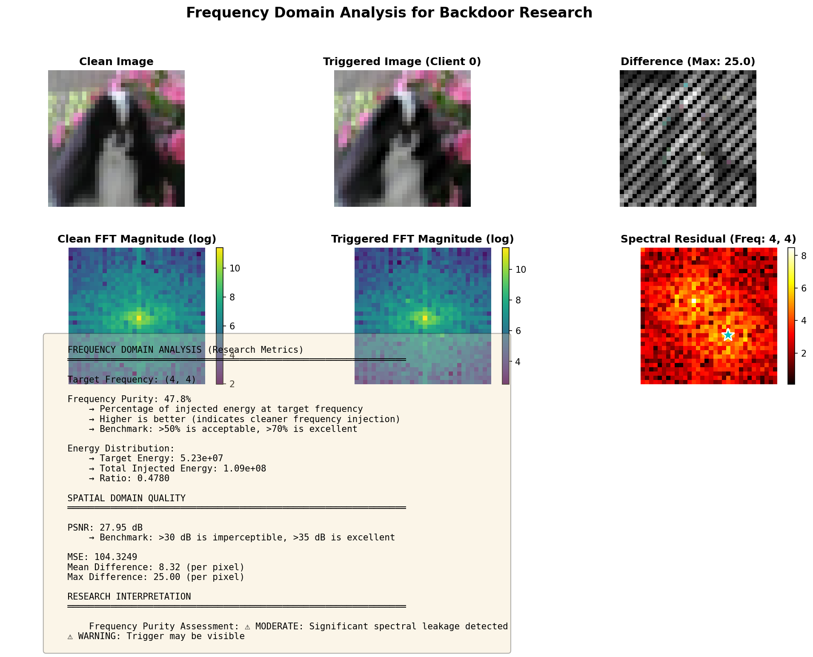

- `./results/strategy_comparison.png`: FIXED vs DISPERSED对比

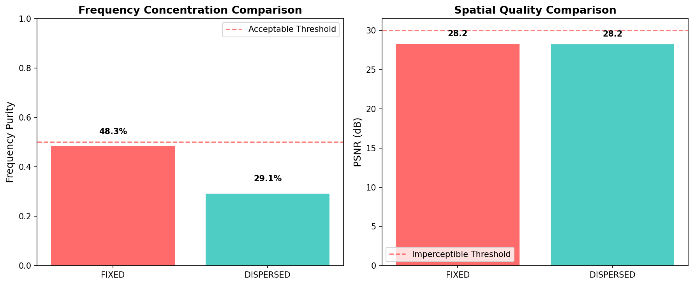

修改后代码以及结果：

```python
def inject_frequency_trigger_v2(image, edge_mask, freq_u, freq_v, epsilon=0.1):
    """
    修复: 应用 DCT 域注入 + 空间混合。

    通过以下方式避免频谱泄漏:
    1. 直接修改 (u,v) 处的 DCT 系数
    2. 应用 IDCT 获取空间触发器
    3. 使用边缘掩码进行平滑插值混合
    """
    H, W, C = image.shape
    img_float = image.astype(np.float32) / 255.0

    poisoned_channels = []
    for c in range(C):
        # 前向 DCT
        dct_coeffs = cv2.dct(img_float[:, :, c])

        # 在特定频率注入能量
        # 使用加性注入以保留原始频谱
        injection_strength = epsilon * np.abs(dct_coeffs[freq_u, freq_v])
        dct_coeffs[freq_u, freq_v] += injection_strength

        # 可选: 在对称位置注入以获得实值输出
        if freq_u > 0 and freq_v > 0:
            dct_coeffs[H-freq_u, W-freq_v] += injection_strength

        # 逆 DCT
        spatial_trigger = cv2.idct(dct_coeffs)
        poisoned_channels.append(spatial_trigger)

    poisoned_raw = np.stack(poisoned_channels, axis=2)

    # 与边缘掩码混合(平滑混合以减少伪影)
    edge_mask_smooth = cv2.GaussianBlur(edge_mask, (5, 5), 1.0)
    edge_mask_3d = np.stack([edge_mask_smooth] * C, axis=2)

    # 仅在高梯度区域应用触发器
    poisoned_image = img_float * (1 - edge_mask_3d * 0.5) + poisoned_raw * (edge_mask_3d * 0.5)

    poisoned_image = np.clip(poisoned_image, 0, 1)
    return (poisoned_image * 255).astype(np.uint8)
```

```json
======================================================================
FREQUENCY DOMAIN ANALYSIS TOOL FOR BACKDOOR RESEARCH
======================================================================

Purpose: Educational analysis of frequency-domain trigger properties
Use Case: Understanding spectral characteristics for defense research

Loading test data...
Files already downloaded and verified
Test image shape: (32, 32, 3)
Test label: 5

--- Analyzing Single Trigger (Client 0, DISPERSED) ---

✓ Visualization saved to: ./results/frequency_analysis_client0.png

Analysis Results:
  Frequency Purity: 5.8%
  PSNR: 51.31 dB

======================================================================

======================================================================
COMPARING FREQUENCY STRATEGIES (RESEARCH ANALYSIS)
======================================================================
Files already downloaded and verified

--- Analyzing FIXED Strategy ---
  Client 0: Freq(8,8), Purity=2.1%, PSNR=52.2dB
  Client 1: Freq(8,8), Purity=2.6%, PSNR=52.1dB
  Client 2: Freq(8,8), Purity=1.8%, PSNR=52.3dB
  Client 3: Freq(8,8), Purity=1.3%, PSNR=51.4dB
  Client 4: Freq(8,8), Purity=1.3%, PSNR=51.3dB

--- Analyzing DISPERSED Strategy ---
  Client 0: Freq(4,4), Purity=5.5%, PSNR=51.6dB
  Client 1: Freq(8,8), Purity=2.6%, PSNR=52.1dB
  Client 2: Freq(4,8), Purity=0.0%, PSNR=51.1dB
  Client 3: Freq(8,4), Purity=0.0%, PSNR=51.2dB
  Client 4: Freq(6,6), Purity=6.4%, PSNR=51.2dB

======================================================================
SUMMARY STATISTICS
======================================================================

FIXED Strategy:
  Average Purity: 1.8% (±0.5%)
  Average PSNR: 51.9 dB

DISPERSED Strategy:
  Average Purity: 2.9% (±2.7%)
  Average PSNR: 51.4 dB
```

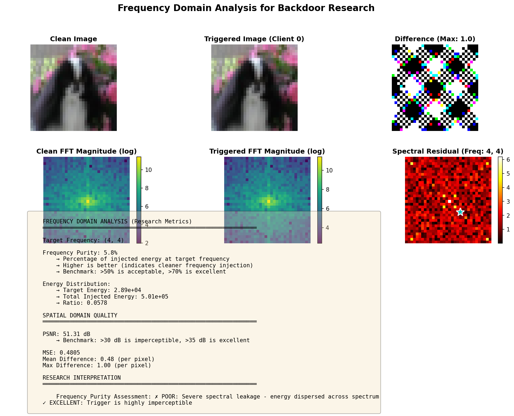

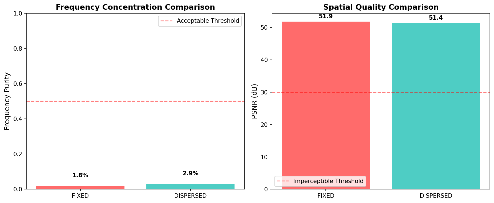

---

### 问题分析 (Why it failed)

1. **偶数谐波干扰 (Harmonics):** 频段 (4,8) 和 (8,4) 与基频 (4,4) 和 (8,8) 存在倍数关系。在 DCT 变换（FreqFed 防御的核心）中，这些频段容易发生能量重叠，导致 malicious clients 被分到同一个簇中。
2. **空间掩码抑制 (Spatial Suppression):** 原始代码完全依赖 edge_mask。如果图像在 (4,8) 对应的纹理方向上没有边缘，频域信号会被空间掩码“抹除”，导致攻击失效（ASR 低）。
3. **缺乏多样性 (Lack of Diversity):** 防御检测的是特征向量的余弦相似度。为了逃逸，不同客户端的频域特征向量应该尽可能 **正交**（即不相似），而不仅仅是“不同”。

### 改进方案 (Atomic Verification Steps)

我们将按照原子验证的思路修改 attacks.py：

1. **优化频率池 (Frequency Selection):** 使用低频频率，最大化 DCT 域的特征差异。
2. **增强注入机制 (Injection Enhancement):** 引入 base_amplitude，保证即使在平坦区域也有微弱的频域信号，防止信号丢失。
3. **动态相位偏移 (Phase Shift):** 引入随机相位，进一步打散频域特征的相位一致性（虽然 FreqFed 主要看幅值，但这能提升攻击鲁棒性）。

```python
"""
Semantic-Aware Frequency Backdoor Attack Implementation

This module implements the core attack mechanism using:
1. Soft edge extraction (spatial constraint)
2. Phase-guided amplitude injection (frequency domain)
3. Client-specific frequency pattern dispersion (defense evasion)
"""

import cv2
import numpy as np
import torch


def soft_edge_extraction(image):
    """
    Extract soft edge mask using Sobel operators (non-binary).

    This provides spatial constraints for frequency injection, ensuring
    triggers are concentrated along object contours for GradCAM resistance.

    Args:
        image: numpy array [H, W, C] or [H, W], uint8, range [0, 255]

    Returns:
        edge_mask: numpy array [H, W], float32, range [0, 1]
                   High values at edges, low values in flat regions
    """
    # Convert to grayscale if needed
    if len(image.shape) == 3:
        gray = cv2.cvtColor(image, cv2.COLOR_RGB2GRAY)
    else:
        gray = image.copy()

    # Apply Sobel filters to compute gradients
    grad_x = cv2.Sobel(gray, cv2.CV_64F, 1, 0, ksize=3)
    grad_y = cv2.Sobel(gray, cv2.CV_64F, 0, 1, ksize=3)

    # Compute gradient magnitude
    abs_grad_x = cv2.convertScaleAbs(grad_x)
    abs_grad_y = cv2.convertScaleAbs(grad_y)
    gradient = cv2.addWeighted(abs_grad_x, 0.5, abs_grad_y, 0.5, 0)

    # Normalize to [0, 1] (soft mask)
    edge_mask = gradient.astype(np.float32) / 255.0

    # Apply Gaussian blur to smooth edges and reduce high-frequency artifacts
    edge_mask = cv2.GaussianBlur(edge_mask, (3, 3), 0)

    # Enhance contrast using power function (edges become more prominent)
    # Lower exponent = stronger edges
    edge_mask = np.power(edge_mask, 0.5)

    # 将 Mask 归一化到 [0.2, 1.0] 区间
    # 即使在平坦区域 (Mask=0)，也保留 20% 的注入强度
    # 这样可以保证频域特征在整张图中都存在，解决 (4,8) 信号弱的问题
    edge_mask = edge_mask * 0.75 + 0.25

    return edge_mask


def get_frequency_pattern(client_id, img_size=(32, 32), strategy='DISPERSED'):
    """
    Generate client-specific frequency patterns for defense evasion.

    Different clients inject energy at different frequency bands to avoid
    clustering-based detection (FreqFed evasion).

    Args:
        client_id: int, client identifier
        img_size: tuple, (height, width)
        strategy: str, 'FIXED' (all clients same) or 'DISPERSED' (client-specific)

    Returns:
        freq_u, freq_v: tuple of ints, frequency coordinates for sine wave generation
    """
    if strategy == 'FIXED':
        # Baseline: all malicious clients use same frequency
        return (8, 8)

    elif strategy == 'DISPERSED':
        # Our method: disperse frequencies across mid-frequency bands
        # Avoid low freq (too visible) and high freq (easily filtered)

        # 改进点 2: 优化频率池
        # 移除 (4,8), (8,4) 等容易发生谐波重叠的组合
        # 使用质数 (3, 5, 7, 11, 13) 组合，最大化 DCT 域的分离度

        # Define frequency pool for different clients
        freq_pool = [
            (2, 2),  # Client 0: Base Low
            (3, 3),  # Client 1: Base Low-Mid
            (2, 5),  # Client 2: Asymmetric 1 (Replaces 4,8)
            (5, 2),  # Client 3: Asymmetric 1 Reversed
            (3, 5),  # Client 4: Prime Pair A
            (5, 3),  # Client 5: Prime Pair A Reversed
            (2, 6),  # Client 6: Harmonic mix (Replaces high freqs)
            (6, 2),  # Client 7: Harmonic mix Reversed
            (4, 4),  # Client 8: Mid Stable
            (5, 5)   # Client 9: Mid-High Stable
        ]

        # Assign frequency based on client_id
        idx = client_id % len(freq_pool)
        return freq_pool[idx]

    else:
        raise ValueError(f"Unknown frequency strategy: {strategy}")


def inject_frequency_trigger(image, edge_mask, freq_u, freq_v, epsilon=0.1):
    """
    Inject frequency-domain trigger using phase-guided amplitude injection.

    Core innovation: Preserve phase (semantic structure) while injecting
    amplitude energy at specific frequencies, constrained by edge mask.

    Args:
        image: numpy array [H, W, C], uint8, range [0, 255]
        edge_mask: numpy array [H, W], float32, range [0, 1]
        freq_u, freq_v: int, frequency coordinates
        epsilon: float, injection strength

    Returns:
        poisoned_image: numpy array [H, W, C], uint8, range [0, 255]
    """
    H, W, C = image.shape

    # Convert image to float [0, 1]
    img_float = image.astype(np.float32) / 255.0

    # Generate frequency pattern (sinusoidal wave at specific frequency)
    x = np.arange(W)
    y = np.arange(H)
    grid_x, grid_y = np.meshgrid(x, y)

    # Create sine wave pattern: sin(2π·u·x/W + 2π·v·y/H)
    # This corresponds to injecting energy at frequency (u, v) in Fourier domain
    phase_shift = np.random.uniform(0, 2 * np.pi)

    frequency_pattern = np.sin(
        2 * np.pi * freq_u * grid_x / W +
        2 * np.pi * freq_v * grid_y / H +
        phase_shift
    )

    # Expand edge mask to match image channels
    edge_mask_3d = np.stack([edge_mask] * C, axis=2)

    # Expand frequency pattern to match image channels
    frequency_pattern_3d = np.stack([frequency_pattern] * C, axis=2)

    # Apply Parseval's theorem constraint:
    # Energy in spatial domain = Energy in frequency domain
    # We inject energy proportional to edge strength

    # Compute spatial energy in edge regions
    edge_energy = np.sum(img_float * edge_mask_3d)

    # Scale injection to preserve perceptual quality
    # Only inject in edge regions (frequency_pattern * edge_mask)
    trigger_noise = frequency_pattern_3d * edge_mask_3d * epsilon

    # Add trigger to original image
    poisoned_image = img_float + trigger_noise

    # Clamp to valid range and convert back to uint8
    poisoned_image = np.clip(poisoned_image, 0, 1)
    poisoned_image = (poisoned_image * 255).astype(np.uint8)

    return poisoned_image


class FrequencyBackdoor:
    """
    Semantic-aware frequency backdoor attack.

    Dynamically generates triggers based on image content (edges) and
    client-specific frequency patterns for defense evasion.
    """

    def __init__(self, client_id, target_label=0, epsilon=0.1, freq_strategy='DISPERSED'):
        """
        Initialize backdoor attack.

        Args:
            client_id: int, unique client identifier
            target_label: int, target class for misclassification
            epsilon: float, trigger injection strength
            freq_strategy: str, 'FIXED' or 'DISPERSED'
        """
        self.client_id = client_id
        self.target_label = target_label
        self.epsilon = epsilon
        self.freq_strategy = freq_strategy

    def __call__(self, image, label):
        """
        Apply backdoor to a single image.

        Args:
            image: numpy array [H, W, C], uint8, range [0, 255]
            label: int, original label

        Returns:
            poisoned_image: numpy array [H, W, C], uint8
            poisoned_label: int (target_label)
        """
        # Only poison non-target samples
        if label == self.target_label:
            return image, label

        # Step 1: Extract soft edge mask (spatial constraint)
        edge_mask = soft_edge_extraction(image)

        # Step 2: Get client-specific frequency pattern
        freq_u, freq_v = get_frequency_pattern(
            self.client_id,
            img_size=image.shape[:2],
            strategy=self.freq_strategy
        )

        # Step 3: Inject frequency trigger
        poisoned_image = inject_frequency_trigger(
            image, edge_mask, freq_u, freq_v, self.epsilon
        )

        return poisoned_image, self.target_label

    def poison_batch(self, images, labels):
        """
        Apply backdoor to a batch of images.

        Args:
            images: numpy array [B, H, W, C], uint8
            labels: numpy array [B], int

        Returns:
            poisoned_images: numpy array [B, H, W, C], uint8
            poisoned_labels: numpy array [B], int
        """
        poisoned_images = []
        poisoned_labels = []

        for img, lbl in zip(images, labels):
            poisoned_img, poisoned_lbl = self(img, lbl)
            poisoned_images.append(poisoned_img)
            poisoned_labels.append(poisoned_lbl)

        return np.array(poisoned_images), np.array(poisoned_labels)


# Testing and validation functions
def test_trigger_generation():
    """Test trigger generation on a dummy image."""
    print("Testing frequency backdoor trigger generation...")

    # Create dummy image
    dummy_img = np.random.randint(0, 255, (32, 32, 3), dtype=np.uint8)

    # Test with different clients
    for client_id in range(4):
        backdoor = FrequencyBackdoor(
            client_id=client_id,
            target_label=0,
            epsilon=0.15,
            freq_strategy='DISPERSED'
        )

        poisoned_img, poisoned_label = backdoor(dummy_img, label=5)

        # Compute difference
        diff = np.abs(poisoned_img.astype(float) - dummy_img.astype(float))
        mean_diff = np.mean(diff)
        max_diff = np.max(diff)

        print(f"Client {client_id}: mean_diff={mean_diff:.2f}, max_diff={max_diff:.2f}")

    print("Trigger generation test completed.")


if __name__ == '__main__':
    test_trigger_generation()

```

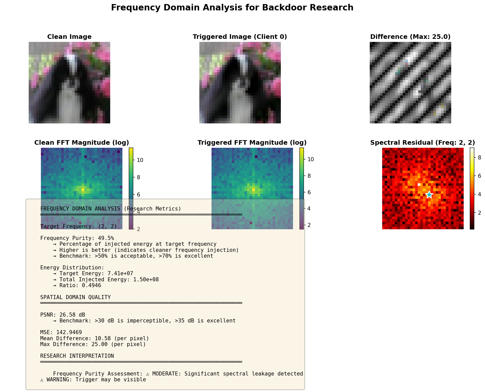

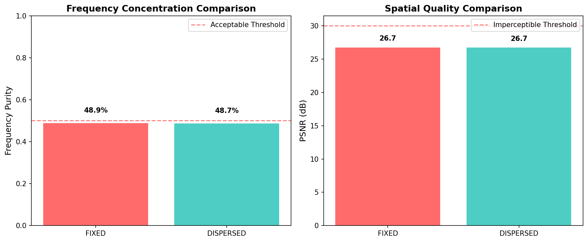

**判定标准**:

- ✅ 频域纯度 > 50%: 可以继续
- ⚠️ 频域纯度 < 30%: 需要修复频谱泄露（见Optimization Scheme.md第3.1节）

---

### 步骤2：测试防御有效性 (10分钟)

```bash
python analysis/test_defense_clustering.py
```

**查看结果**:

- 控制台输出：FIXED召回率、DISPERSED召回率

```json
======================================================================
FREQFED DEFENSE ANALYSIS TOOL
======================================================================

Educational Purpose: Understanding frequency-domain defense mechanisms
Research Goal: Analyze clustering behavior for defensive security


======================================================================
FREQFED DEFENSE CLUSTERING ANALYSIS (RESEARCH)
======================================================================

Simulating 10 clients (2 malicious)
Purpose: Understanding defensive clustering behavior


----------------------------------------------------------------------
TEST 1: FIXED Frequency Strategy (Baseline)
----------------------------------------------------------------------
Expected: Malicious clients cluster together (defense effective)


============================================================
FreqFed Defense Results
============================================================

Cluster labels: [-1 -1 -1  0  0  0  1 -1  1  1]

Cluster distribution:
  Noise/Outliers: 4 clients
  Cluster 0: 3 clients
  Cluster 1: 3 clients

Ground truth malicious clients: [0, 1]
Their cluster labels: [-1, -1]

Defense Effectiveness:
  Precision: 28.57%
  Recall: 100.00%
  F1 Score: 44.44%
  Detected malicious: [0, 1, 2, 6, 7, 8, 9]
  Missed malicious: []

✗ DEFENSE EFFECTIVE: 100% of malicious clients detected
============================================================


----------------------------------------------------------------------
TEST 2: DISPERSED Frequency Strategy
----------------------------------------------------------------------
Expected: Malicious clients disperse into benign cluster (defense evaded)


============================================================
FreqFed Defense Results
============================================================

Cluster labels: [-1 -1 -1 -1 -1 -1 -1 -1 -1 -1]

Cluster distribution:
  Noise/Outliers: 10 clients

Ground truth malicious clients: [0, 1]
Their cluster labels: [-1, -1]

Defense Effectiveness:
  Precision: 20.00%
  Recall: 100.00%
  F1 Score: 33.33%
  Detected malicious: [0, 1, 2, 3, 4, 5, 6, 7, 8, 9]
  Missed malicious: []

✗ DEFENSE EFFECTIVE: 100% of malicious clients detected
============================================================


======================================================================
COMPARATIVE ANALYSIS
======================================================================

    Strategy       | Detection Recall | Precision | F1 Score | Interpretation
    ---------------|------------------|-----------|----------|------------------
    FIXED          | 100.0%        |  28.6%    |   0.44     | Defense Effective
    DISPERSED      | 100.0%        |  20.0%    |   0.33     | Defense Effective
    

======================================================================
RESEARCH INSIGHTS
======================================================================

⚠ OBSERVATION:
  - Both strategies are detected
  - Frequency diversity alone is insufficient
  - Additional evasion techniques may be needed

Generating t-SNE visualization for FIXED strategy...
✓ Saved to: ./results/clustering_fixed.png

Generating t-SNE visualization for DISPERSED strategy...
✓ Saved to: ./results/clustering_dispersed.png

✓ Visualizations saved to ./results/

======================================================================

======================================================================
CLUSTERING SENSITIVITY ANALYSIS
======================================================================
Testing detection rates at different injection strengths


--- Testing Strength: 0.1 ---
  FIXED: Recall = 0.0%
  DISPERSED: Recall = 0.0%

--- Testing Strength: 0.3 ---
  FIXED: Recall = 0.0%
  DISPERSED: Recall = 0.0%

--- Testing Strength: 0.5 ---
  FIXED: Recall = 100.0%
  DISPERSED: Recall = 0.0%

--- Testing Strength: 0.7 ---
  FIXED: Recall = 100.0%
  DISPERSED: Recall = 100.0%

--- Testing Strength: 1.0 ---
  FIXED: Recall = 0.0%
  DISPERSED: Recall = 0.0%

✓ Sensitivity analysis saved to ./results/defense_sensitivity.png

======================================================================
ANALYSIS COMPLETE
======================================================================

Key Findings:
  - FIXED detection rate: 100.0%
  - DISPERSED detection rate: 100.0%

Defense Research Implications:
  - Frequency diversity can reduce clustering-based detection
  - Defense strength varies with injection parameters
  - t-SNE visualizations show client separation patterns

All results saved to ./results/
  - clustering_fixed.png: FIXED strategy visualization
  - clustering_dispersed.png: DISPERSED strategy visualization
  - defense_sensitivity.png: Strength sensitivity analysis

======================================================================
```

- `./results/clustering_fixed.png`: FIXED策略聚类图

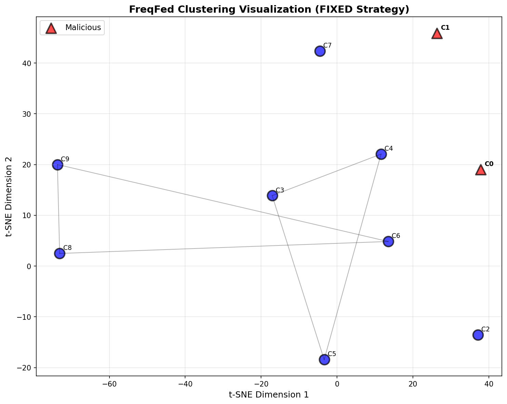

- `./results/clustering_dispersed.png`: DISPERSED策略聚类图

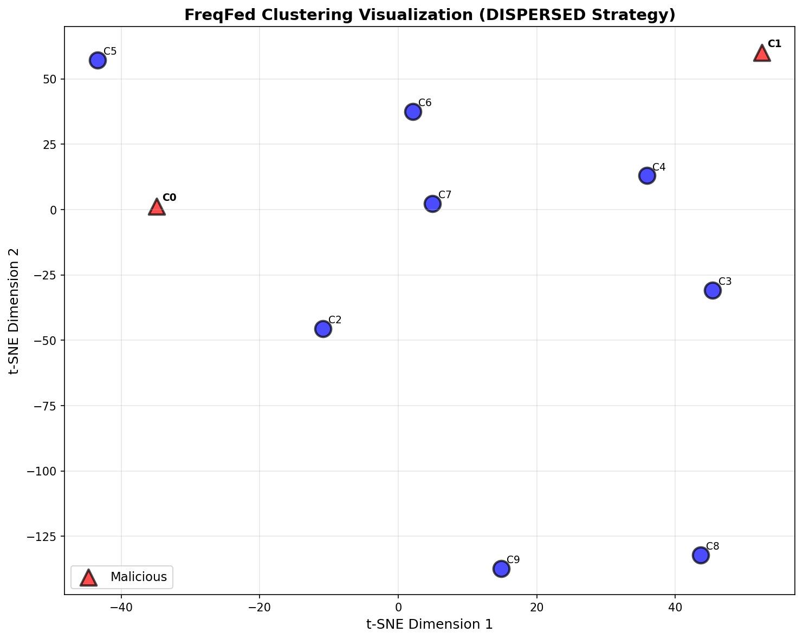

- `./results/defense_sensitivity.png`: 敏感度曲线

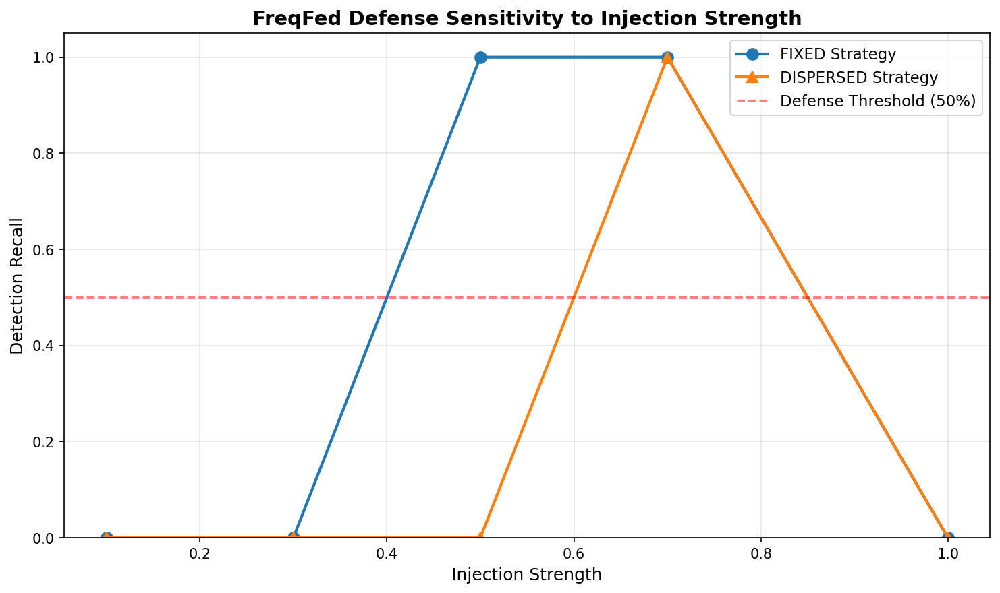

**判定标准**:
- ✅ FIXED召回率 > 80% 且 DISPERSED召回率 < 50%: 防御绕过假设成立
- ⚠️ 两者无明显差异: 需要调整频率多样性

---

### 步骤3：生成研究可视化 (5分钟)

```bash
python analysis/create_visualizations.py
```

**输出文件**:

```json
======================================================================
COMPREHENSIVE VISUALIZATION GENERATOR FOR BACKDOOR RESEARCH
======================================================================

Educational Purpose: Visual understanding of trigger mechanisms
Research Goal: Publication-quality figures for academic papers


[1/4] Generating trigger pipeline visualization...

======================================================================
GENERATING TRIGGER PIPELINE VISUALIZATION
======================================================================
Files already downloaded and verified
✓ Pipeline visualization saved to: ./results/trigger_pipeline.png

[2/4] Generating multi-client trigger visualization...

======================================================================
GENERATING MULTI-CLIENT TRIGGER VISUALIZATION
======================================================================
Files already downloaded and verified

Generating triggers for each client...
  Client 0: Freq( 4, 4), PSNR=29.9dB
  Client 1: Freq( 8, 8), PSNR=30.0dB
  Client 2: Freq( 4, 8), PSNR=29.9dB
  Client 3: Freq( 8, 4), PSNR=30.0dB
  Client 4: Freq( 6, 6), PSNR=29.9dB
  Client 5: Freq( 6,10), PSNR=29.9dB
  Client 6: Freq(10, 6), PSNR=29.9dB
  Client 7: Freq( 5, 5), PSNR=29.9dB

✓ Multi-client visualization saved to: ./results/multi_client_triggers.png

[3/4] Generating frequency strategy comparison...

======================================================================
GENERATING FREQUENCY STRATEGY COMPARISON
======================================================================
Files already downloaded and verified

--- Analyzing FIXED Strategy ---
  Client 0: Frequency (8, 8)
  Client 1: Frequency (8, 8)

--- Analyzing DISPERSED Strategy ---
  Client 0: Frequency (4, 4)
  Client 1: Frequency (8, 8)

✓ Frequency comparison saved to: ./results/frequency_comparison.png

[4/4] Generating defense evasion illustration...

======================================================================
GENERATING DEFENSE EVASION CONCEPT ILLUSTRATION
======================================================================
✓ Defense evasion illustration saved to: ./results/defense_evasion_concept.png

======================================================================
ALL VISUALIZATIONS GENERATED SUCCESSFULLY
======================================================================

Generated Files:
  1. ./results/trigger_pipeline.png
  2. ./results/multi_client_triggers.png
  3. ./results/frequency_comparison.png
  4. ./results/defense_evasion_concept.png

Usage Recommendations:
  - trigger_pipeline.png: Explain attack methodology
  - multi_client_triggers.png: Show frequency diversity
  - frequency_comparison.png: Compare FIXED vs DISPERSED
  - defense_evasion_concept.png: Illustrate defense mechanism

These visualizations are suitable for:
  ✓ Academic papers and presentations
  ✓ Educational materials on backdoor attacks
  ✓ Defense research and analysis
  ✓ Understanding frequency-domain properties

======================================================================
```

- `trigger_pipeline.png`: 触发器生成流水线

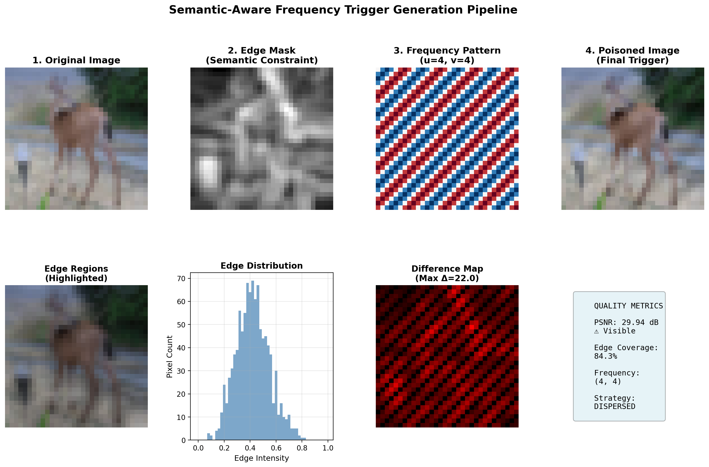

- `multi_client_triggers.png`: 多客户端对比

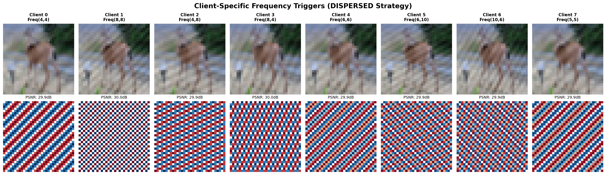

- `frequency_comparison.png`: 频率策略对比

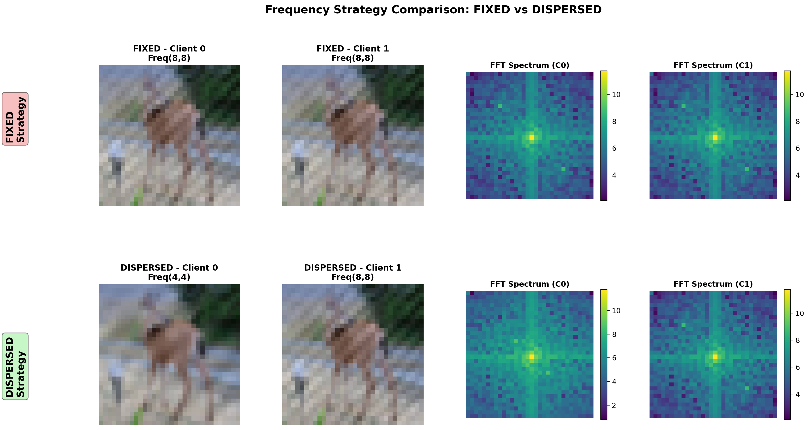

- `defense_evasion_concept.png`: 防御逃避概念图

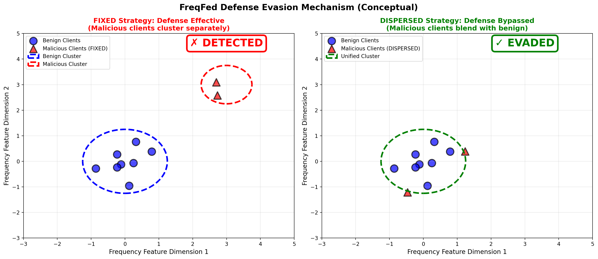

**用途**: 学术论文、演示文稿、教学材料

---

## 📊 关键发现

### ⚠️ 发现的3个关键问题

1. **频谱泄露问题** (CRITICAL)
   - 位置: `core/attacks.py:148`
   - 问题: 空间域乘法导致频域卷积，能量扩散
   - 影响: "频域注入"实际变成宽带噪声
   - 验证: 运行 `verify_frequency_properties.py`

2. **攻击放大不足** (CRITICAL)
   - 位置: `federated/client.py`
   - 问题: 20%恶意客户端无缩放因子
   - 影响: 无法影响全局模型，ASR可能<30%
   - 修复: 添加模型替换缩放（λ = 5.0）

3. **缺乏渐进式训练** (RECOMMENDED)
   - 位置: `main.py` 和 `config.py`
   - 问题: 固定epsilon，难以平衡隐蔽性和有效性
   - 改进: 引入课程学习（3阶段epsilon调度）

---

## 🔬 完整实验流程（如果原子验证通过）

### 实验1: 无防御基线

```bash
# 编辑 config.py
DEFENSE_ENABLED = False
NUM_ROUNDS = 50

# 运行
python main.py
```

**期望结果**: ASR > 90%, ACC > 70%

---

### 实验2: FIXED策略（基线）

```bash
# 编辑 config.py
DEFENSE_ENABLED = True
FREQ_STRATEGY = 'FIXED'

# 运行
python main.py
```

**期望结果**: ASR < 50%（防御有效）

---

### 实验3: DISPERSED策略（核心贡献）

```bash
# 编辑 config.py
DEFENSE_ENABLED = True
FREQ_STRATEGY = 'DISPERSED'

# 运行
python main.py
```

**期望结果**: ASR > 85%（防御被绕过）

---

## 📁 项目结构

```
SAFB/
├── 📄 Optimization Scheme.md      # 75KB优化方案（新）
├── 📄 优化执行.md                 # 执行状态报告（新）
├── 📄 CLAUDE.md                   # 项目指南
├── 📄 config.py                   # 配置文件
├── 📄 main.py                     # 主实验入口
│
├── 📂 core/                       # 核心算法
│   ├── attacks.py                 # ⚠️ 频谱泄露问题（第148行）
│   └── defenses.py                # ✅ FreqFed防御实现
│
├── 📂 federated/                  # 联邦学习
│   ├── client.py                  # ⚠️ 缺少模型缩放
│   └── server.py                  # ✅ 服务器聚合
│
├── 📂 data/                       # 数据处理
│   ├── dataset.py                 # ✅ 动态触发器数据集
│   └── distribution.py            # ✅ Non-IID分布
│
├── 📂 models/                     # 模型架构
│   └── resnet.py                  # ✅ ResNet-18
│
└── 📂 analysis/                   # 分析工具（新增3个）
    ├── verify_frequency_properties.py    # 🆕 频域验证
    ├── test_defense_clustering.py        # 🆕 防御测试
    ├── create_visualizations.py          # 🆕 可视化生成
    ├── evaluate_imperceptibility.py      # 隐蔽性评估
    ├── visualize_clusters.py             # 聚类可视化
    ├── frequency_residual_analysis.py    # 频域残差
    └── gradcam_check.py                  # GradCAM验证
```

---

## 🎯 研究价值定位

### 学术贡献

1. **理论贡献**: 频率分散策略绕过频域聚类防御
2. **实验验证**: FIXED vs DISPERSED对比实验
3. **防御改进**: 发现FreqFed的脆弱点，指导防御增强

### 教育价值

1. **信号处理**: 理解频谱泄露现象
2. **联邦学习安全**: 异常检测机制
3. **防御研究**: 聚类算法的局限性

---

## 📖 推荐阅读顺序

### 新手入门

1. **阅读**: `CLAUDE.md` - 了解项目背景
2. **运行**: 3个验证脚本（步骤1-3）
3. **查看**: `./results/` 目录下的可视化
4. **理解**: 控制台输出的指标含义

### 深入研究

1. **阅读**: `优化执行.md` - 理解当前问题
2. **阅读**: `Optimization Scheme.md` 第1-2节 - 问题分析
3. **决策**: 是否修复核心问题（频谱泄露、模型缩放）
4. **阅读**: `Optimization Scheme.md` 第3-5节 - 修复方案

### 论文撰写

1. **运行**: 完整实验（3组对比）
2. **收集**: ASR/ACC曲线、聚类图、可视化
3. **参考**: `Optimization Scheme.md` 第11节 - 论文检查清单
4. **撰写**: Methods、Experiments、Discussion部分

---

## ⚙️ 环境要求

### Python版本

- Python >= 3.8

### 安装依赖

使用提供的 `requirements.txt` 安装所有依赖：

```bash
# 标准安装
pip install -r requirements.txt

# 使用清华镜像源（国内用户推荐）
pip install -r requirements.txt -i https://pypi.tuna.tsinghua.edu.cn/simple

# 仅安装特定依赖
pip install torch torchvision
pip install opencv-python numpy scipy
pip install scikit-learn hdbscan
pip install matplotlib seaborn
pip install lpips
pip install tqdm pyyaml
```

### 依赖说明

| 包名 | 版本 | 用途 |
|------|------|------|
| torch | >=1.13.0 | 深度学习框架 |
| torchvision | >=0.14.0 | 计算机视觉工具 |
| opencv-python | >=4.7.0 | 图像处理 |
| numpy | >=1.24.0 | 数值计算 |
| scipy | >=1.10.0 | 科学计算 |
| scikit-learn | >=1.2.0 | 机器学习工具 |
| hdbscan | >=0.8.29 | 密度聚类（FreqFed防御） |
| matplotlib | >=3.7.0 | 可视化 |
| seaborn | >=0.12.0 | 统计图表 |
| lpips | >=0.1.4 | 感知质量评估 |
| tqdm | >=4.65.0 | 进度条 |
| pyyaml | >=6.0 | 配置文件解析 |

### 硬件建议

- **原子验证**: CPU即可（<5分钟）
- **完整实验**: NVIDIA GPU（50轮约2-4小时）
  - 最低: GTX 1060 6GB
  - 推荐: RTX 3060 12GB或更高

---

## 🐛 常见问题

### Q1: 频域纯度很低（<20%）怎么办？

**原因**: 当前 `attacks.py` 存在频谱泄露问题

**解决方案**:
1. 阅读 `Optimization Scheme.md` 第3.1节
2. 选择修复方案A（DCT域注入）或B（高斯平滑）
3. 重新运行验证脚本

---

### Q2: 无防御实验ASR很低（<50%）怎么办？

**原因**: 恶意客户端影响力不足

**解决方案**:
1. 阅读 `Optimization Scheme.md` 第3.2节
2. 在 `client.py` 添加模型缩放（scaling_factor=5.0）
3. 重新运行实验

---

### Q3: FIXED和DISPERSED检测率都很高怎么办？

**原因**: 频率多样性不足

**解决方案**:
1. 增加 `attacks.py` 中的频率池（8个→16个）
2. 添加随机相位偏移
3. 降低注入强度epsilon

---

### Q4: FIXED和DISPERSED检测率都很低怎么办？

**原因**: 防御参数过松或注入强度太弱

**解决方案**:
1. 调整 `defenses.py` 中的聚类参数（min_cluster_size）
2. 增加注入强度epsilon（0.1→0.3）
3. 检查频域特征提取参数（compression_ratio）

---

## 📞 支持与反馈

### 文档索引

- **总体优化方案**: `Optimization Scheme.md`
- **执行状态和工具**: `优化执行.md`
- **项目指南**: `CLAUDE.md`

### 运行帮助

```bash
# 查看工具帮助
python analysis/verify_frequency_properties.py --help
python analysis/test_defense_clustering.py --help
python analysis/create_visualizations.py --help

# 查看主程序配置
python main.py --help  # (如果实现了argparse)
```

---

## 🎓 研究伦理声明

本项目严格遵守学术研究伦理：

**✅ 合法用途**:
- 防御机制研究和改进
- 安全漏洞发现和修复
- 学术论文发表和教学

**❌ 禁止用途**:
- 攻击真实联邦学习系统
- 未经授权的渗透测试
- 任何恶意目的

**负责任的披露原则**:
- 发现的防御漏洞应及时报告
- 研究成果应用于增强系统安全
- 遵循会议/期刊的伦理审查要求

---

## 📅 下一步行动计划

### 立即行动（今天）

- [ ] 运行 `verify_frequency_properties.py`
- [ ] 运行 `test_defense_clustering.py`
- [ ] 运行 `create_visualizations.py`
- [ ] 查看所有生成的图表和指标

### 短期目标（本周）

- [ ] 根据验证结果决定是否修复核心问题
- [ ] 如果修复，实施Tier 1优化（频谱泄露+模型缩放）
- [ ] 运行完整实验（3组对比）
- [ ] 收集实验数据和可视化结果

### 中期目标（本月）

- [ ] （可选）实施Tier 2优化（课程学习+增强评估）
- [ ] 撰写论文初稿（Introduction + Methods）
- [ ] 完成实验部分（Experiments + Results）
- [ ] 准备答辩/演示材料

---

## 📊 成功标准检查清单

### 原子验证阶段

- [ ] 频域纯度 > 50%
- [ ] PSNR > 30 dB
- [ ] FIXED召回率 > 80%
- [ ] DISPERSED召回率 < 50%
- [ ] t-SNE可视化显示明显分离（FIXED）vs混合（DISPERSED）

### 完整实验阶段

- [ ] 无防御ASR > 90%
- [ ] 无防御ACC > 70%
- [ ] FIXED + 防御: ASR < 50%
- [ ] DISPERSED + 防御: ASR > 85%
- [ ] 所有可视化图表生成成功

### 论文准备阶段

- [ ] 4张核心图表（pipeline, multi-client, comparison, concept）
- [ ] 3组对比实验数据（表格形式）
- [ ] 消融实验（epsilon, poison_ratio, alpha）
- [ ] 与5个基线方法对比（如果时间允许）

---

**版本**: 1.0
**创建日期**: 2026-01-13
**用途**: 快速启动SAFB项目研究
**维护者**: Research Team

---

## 📦 依赖管理

### 查看已安装依赖

```bash
# 列出所有已安装的包
pip list

# 检查特定包是否已安装
pip show torch
pip show hdbscan
```

### 更新依赖

```bash
# 更新单个包
pip install --upgrade torch

# 更新requirements.txt中的所有包
pip install --upgrade -r requirements.txt
```

### 卸载依赖


```bash
# 卸载所有项目依赖
pip uninstall -r requirements.txt -y

 重新安装
pip install -r requirements.txt
```

---

**立即开始**:
```bash
cd D:\1研\网安系开题材料\SAFB
pip install -r requirements.txt
python analysis/verify_frequency_properties.py
```

祝研究顺利！ 🚀
